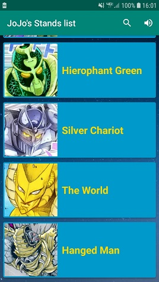
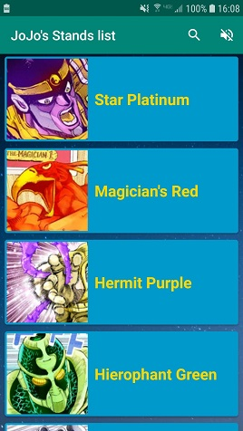
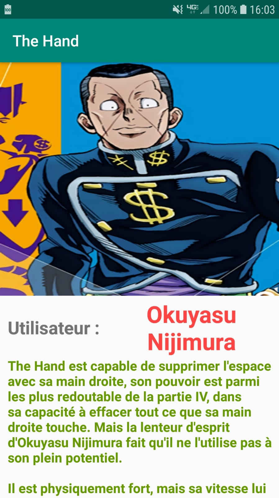
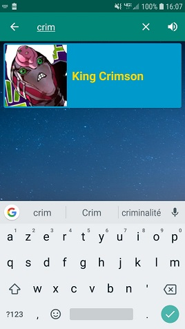

# Projet_Mobile_3A
## Fait par
MOUHAMMADOUL AMINE Abdallah
(3A initial)

## Présentation

Simple projet démontrant l'utilisation de Clean Architecture et du pattern MVVM dans une application android codé en Java.

Cette application permet d'afficher une liste des Stands des parties 3 à 5 de JoJo's Bizarre Adventure. La liste n'est pas exhaustive.

## Consignes respectées :

- Pour une note minimale :

	- Deux écrans : Un écran avec une liste (RecyclerView) et un écran avec un détail de l’item.
	- Appel WebService à une API Rest.
	- Stockage des données en cache.

- Consignes bonus : 

	- Architecture MVVM
	- Gitflow
	- Notifications Push ( Firebase )

- Fonctions supplémentaires :
	
	- Création d'API personnalisée (rly-chrono.fr/api/stands)
	- Barre de recherche (SearchView)
	- Musique en arrière plan (ajout d'un menu pour play et pause quand on appuie dessus)
	

## Fonctionnalités: 

### Ecran Home 

- Affiche la liste des pokémons avec musique on (à gauche) et off (à droite) et une barre de recherche.

         

### Ecran du détail du Stand

- Affiche l'image de l'utilisateur du Stand
- Le nom de l'utilisateur
- Explication du pouvoir du Stand

### Filtres 

